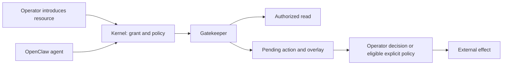

# GatekeeperOS

GatekeeperOS is an independent project. It is not affiliated with or endorsed by the OpenClaw Foundation. OpenClaw is a trademark of its owner.

**capability-based access and deferred approvals for OpenClaw**

GatekeeperOS is a self-hosted capability and operations layer for
[OpenClaw](https://github.com/openclaw/openclaw), inspired by
[Cloudflare OS](https://github.com/cloudflare/cloudflare-os) and its gatekeeper
architecture. It connects an agent to resources through scoped grants rather
than handing the agent unrestricted service credentials.

“OS” describes the layer that manages capabilities, drivers, policy, and isolated
agent environments. This is **not a Linux distribution**, an OpenClaw fork, or a
Cloudflare product. It is an independent project built on those projects' work.

**Status: published beta.5; npm-only messaging-cell acceptance passed.**
All five `@gatekeeper-os` packages are published at `0.1.0-beta.5`.
A fresh snapshot-based npm-only run passed on Node **22.22.3** and unmodified
OpenClaw **2026.9.2**, including independently owned gatekeeper tools and
synthetic approval apply/reject effects and audit. Real filesystem writes remain
disabled; real connected-provider and chat-transport acceptance is not established.
See the [beta.5 release notes](plans/release-notes-beta.5.md) and
[acceptance receipts](plans/PROGRESS.md).

[Architecture](docs/implementation-plan.md) · [Acceptance status](docs/phase-checklist.md) ·
[Contributing](CONTRIBUTING.md) · [Security](SECURITY.md) ·
[Acknowledgments](docs/acknowledgments.md) · [License](LICENSE)

## Why build this?

An assistant may need to read one repository without gaining access to every
repository its operator can see. It may need to draft a change and continue
reasoning about the result while a human reviews whether that change should
actually happen.

GatekeeperOS separates those decisions:

- **Which resource?** An operator introduces a resource, usually by its URL.
- **Which agent and audience?** The kernel binds access to an agent and checks the
  session and audience on use. Beta grants are owner-only.
- **Which operation?** A gatekeeper offers a small, typed API for that resource.
- **Which effects may become real?** Reads are authorized; writes enter an action
  pipeline with a preview and an operator decision. Only explicitly eligible,
  configured actions may be auto-approved.

The goal is useful autonomy with inspectable authority—not a claim that prompts
alone can enforce security or that arbitrary plugins become safe.

## Core concepts

| Concept | What it does |
|---|---|
| **Cell** | A named Gateway environment with its own state, configuration, credentials, and grants. Use separate OS users or hosts when stronger isolation is needed. |
| **Kernel** | Owns grant resolution, tool exposure, authorization, approval decisions, and audit. Kit-owned wrappers register exact manifest tools under each gatekeeper identity; the kernel authorizes and executes calls. |
| **Grant** | An opaque handle connecting an authorized agent to a particular resource. A pasted URL from an untrusted sender is not authority. |
| **Gatekeeper** | A driver for a service or resource, responsible for authentication, bounded operations, and integration with the kernel's action pipeline. |
| **Pending action** | A proposed external effect. When supported, an overlay lets subsequent reads reflect it before the effect is applied. Rejecting it removes that pending view. |
| **Blueprint** | A planned versioned agent configuration: workspace material, tools, skills, and sandbox requirements. Full application and validation are Phase 6 work. |



This diagram describes the architecture. Availability and live acceptance of
each driver are listed below.

### Example: a reviewable GitHub comment

The **Phase 4 target workflow**, not yet accepted end to end, is:

1. Connect a GitHub account and introduce one issue to an agent.
2. Ask the agent to comment and summarize the thread.
3. The comment remains pending; the agent's subsequent read includes it through
   the gatekeeper's overlay.
4. Review and apply the action to post the real comment, or reject it to remove
   it from the pending view.

A pending result is not evidence that an external service changed. Operators
inspect action status and audit evidence. Reversal is driver-specific: deleting
a comment is different from closing a created issue, and not every action can
be reversed.

## What works today—and what does not

| Area | Current evidence and limits |
|---|---|
| Host installation, cells, configuration and backup | Phase 1 source-install acceptance passed on Ubuntu and macOS. This is not a claim that every later driver supports both platforms. |
| Contracts and gatekeeper kit | Phase 2 accepted: encrypted token storage, nonce replay/expiry controls, pending-action overlays and lifecycle helpers. |
| Kernel and filesystem driver | Beta.5 npm-only **messaging baseline**: 114/114 kernel-live checks, including no-grant OS tools, granted filesystem reads, revocation, native denials and simulated-write refusal. Earlier source/full-profile evidence remains historical. |
| Packed model-turn gate | Published beta.5 release candidate passed on Node22.22.3 with independent gatekeeper tool ownership, trusted-policy backstop, synthetic apply/reject effects and audit. Separate from the npm-only run below. |
| npm-only end-to-end checkpoint | **PASS**, run `20260916-220009-phase-3`, Node22.22.3 / OpenClaw2026.9.2: registry identities/tags/times/archive SHA512 5/5, actual cell creation and selector, install policy14/14, kernel-live114/114, selected conformance38/38, owner-only audience72/72, independent approval30/30; 25 local model turns /39 requests. No product source checkout/build/patch. |
| Filesystem writes | Bounded Linux reads and simulated writes are implemented. **Real writes remain disabled** because the approved atomic confinement requirement is not satisfied. |
| Real messaging transports | Synthetic public-SDK ingress is tested. Real Telegram validation is deferred, not passed. No real Slack acceptance is claimed. |
| GitHub | Phase 4 reference driver and real-provider acceptance remain in progress. |
| Approval UX and auto-approval | Kernel infrastructure exists; Phase 5 TUI, real-driver behavior and notification acceptance remain. |
| Blueprints | Scaffold exists; full Phase 6 behavior and acceptance remain. |
| Upgrades and rollback | The upstream pin exists. The complete staged update/rollback and compatibility pipeline is Phase 7 work, not a finished feature. |
| MCP, HTTP and further drivers | Later scope; placeholder packages do not imply functioning integrations. |

The [Phase 3 acceptance record](plans/phase-3-acceptance.md) reports 410 workspace
tests, six VM checkpoints and 23 actual model turns for the accepted candidate.
These are milestone-specific **source-install/full-profile** results, not proof of
the shipped messaging baseline or a substitute for remaining beta gates.
See the [phase checklist](docs/phase-checklist.md) for evidence and the
[Telegram deferral](plans/telegram-validation-deferred.md) for its exact scope.

## Try it from npm

On a disposable evaluation machine with Node 22.22.3+:

```sh
npm install --global @gatekeeper-os/cli@beta
gkos --version
gkos cell create evaluation --port 19100 --policy messaging
```

`@beta` resolves to the published beta.5 line. The snapshot-based npm-only
messaging-cell run passed all selected stages, including independent-gatekeeper
approval effects and audit. Those effects use a synthetic provider; they do not
enable real filesystem writes or prove connected-provider/channel acceptance.
Earlier failed beta runs remain failed evidence in [PROGRESS](plans/PROGRESS.md).
No stable release or ClawHub listing exists yet.

## Getting started as a developer

Use the Node version in
[`.node-version`](.node-version) and pnpm version in
[`package.json`](package.json); the current pins are Node 22.22.3 and pnpm 10.15.0.
The upstream runtime pin is `openclaw@2026.9.2` in
[`gkos.lock.json`](gkos.lock.json). Compatibility ranges are not a claim that
every version in the range has passed acceptance.

```sh
git clone https://github.com/gatekeeper-os/gatekeeper-os.git
cd gatekeeper-os
corepack enable
pnpm install --frozen-lockfile
pnpm typecheck
pnpm test
pnpm check:catalog
pnpm check:secrets
node scripts/check-package-licenses.mjs --pack
```

The build checks run on the development host. Runtime installation and acceptance
belong on a disposable machine, not an everyday Gateway. Start with the
[VM testing guide](docs/vm-testing.md) for supported drivers, prerequisites,
snapshots and exact per-phase commands. The libvirt path is implemented; do not
assume every driver named in the design is implemented.

For a source-install evaluation **inside a disposable machine**:

```sh
./installer/install.sh
gkos status --json
gkos kernel status --json
gkos gatekeeper list --json
gkos grant list --json
gkos approvals list --json
gkos audit tail --limit 20 --json
```

The installer provisions the cell; model credentials and channel configuration
are separate operator setup. Installation does not grant access to arbitrary
directories or external accounts. The verified npm command is shown above; no `curl | bash` installer is advertised here. See the
[CLI documentation](packages/gkos-cli/README.md) for command details.

## Security boundaries

- **OpenClaw stays upstream.** No fork, patch or vendored runtime; integration uses
  documented SDK, configuration and Gateway interfaces. OS state is kept apart
  from upstream's own database.
- **Resources are opt-in.** Gatekeeper calls must resolve a grant; only an
  authorized operator may introduce resources. Grants do not confer general
  access to a service account.
- **Audience matters.** Owner identity alone is insufficient in a group. Private
  grants are denied when a shared or unknown audience would expose their data.
- **Plugins remain trusted code.** Native plugins execute inside the Gateway
  process. This project does not sandbox a malicious plugin or replace host and
  container isolation.
- **Audit is not a transcript.** Audit records capture security-relevant events,
  not tokens, prompts, HTTP headers or raw API bodies. Credentials remain in the
  owning driver's protected storage.
- **Failure is not permission.** Unsupported operations and uncertain external
  effects must not turn into silent grants or blind write retries.

Review [SECURITY.md](SECURITY.md) for reporting and support expectations. Automated
test results do not imply an independent security audit.

## Repository map

| Path | Responsibility |
|---|---|
| `packages/gkos-shared` | Gatekeeper, grant and approval contracts |
| `packages/gkos-kernel` | Capability policy, approvals, audit and operator interfaces |
| `packages/gatekeeper-kit` | Driver lifecycle, token storage, nonce and overlay helpers |
| `packages/gkos-gatekeeper-fs` | Scoped filesystem driver |
| `packages/gkos-gatekeeper-github` | GitHub reference driver under development |
| `packages/gkos-cli` | Host operations and paired operator commands |
| `packages/gkos-conformance` | Live Gateway compatibility and acceptance checks |
| `packages/gkos-blueprints` | Agent-template scaffold |
| `packages/gkos-gatekeeper-mcp`, `packages/gatekeeper-http` | Later-driver placeholders |
| `installer/`, `config/` | Installation and configuration inputs |
| `scripts/vm/`, `test/` | Disposable-machine harness and phase scenarios |
| `docs/`, `plans/` | Design, evidence, limitations and implementation progress |

## Road to the open-source beta

The five-package beta.2 is published under `@gatekeeper-os`; beta.3 is private
preparation for the messaging-policy correction. Repositories remain private.
Public visibility, trusted publishing, community registry-switch builds and
npm-only fresh-VM acceptance are separate gates. No acceptance gate is waived.
The Telegram deferral stays visible. The [publication checklist](docs/open-source-release.md)
records release checks; the [migration note](docs/migration-gatekeeperos.md) records the rename.

## Acknowledgments

**[OpenClaw](https://github.com/openclaw/openclaw)** provides the agent runtime,
Gateway, channels, tools and public plugin interfaces this project builds upon.
GatekeeperOS is an integration layer; it does not claim those foundations as its
own work or imply endorsement by OpenClaw's maintainers.

**[Cloudflare OS](https://github.com/cloudflare/cloudflare-os)** provides the
architectural inspiration: capability introductions, gatekeepers, deferred
approval and simulation, observer checks, and the higher review bar for a small
kernel. Parts of our contracts and development documentation are adapted from
that project. **[Cloudflare OS Starter](https://github.com/cloudflare/cloudflare-os-starter)**
informed the wrapper-owned customization and deliberate upgrade approach.

Thank you to their maintainers and contributors. See
[Acknowledgments and provenance](docs/acknowledgments.md) and [NOTICE](NOTICE)
for sources, adaptation details and license notices. No affiliation or
endorsement is implied; project names and marks belong to their respective owners.

## License and contributions

Original GatekeeperOS contributions are licensed under **MIT**; see [LICENSE](LICENSE).
Third-party and adapted material retains its applicable notices and license
terms, including Apache-2.0 material from Cloudflare OS. The MIT license does not
relicense those upstream contributions. [NOTICE](NOTICE) includes the retained
Apache-2.0 text; bundled dependencies also carry their own notices.

Read [CONTRIBUTING.md](CONTRIBUTING.md) before submitting changes, especially
those affecting capability boundaries. Bugs, focused fixes, reproducible
acceptance evidence and clear documentation are useful contributions. Never
include production credentials or private conversations in reports.
